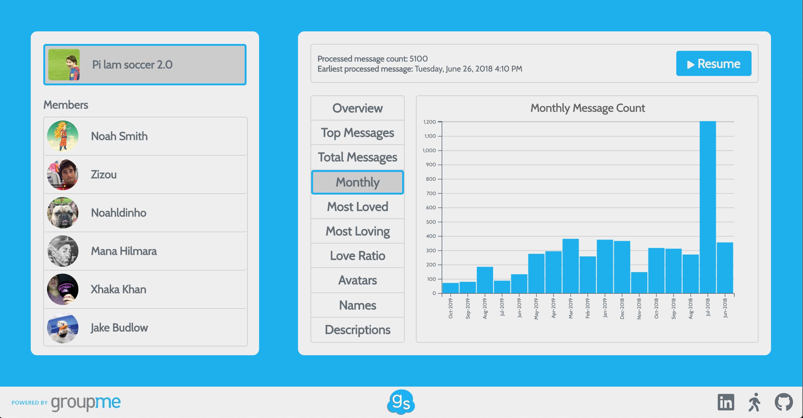

# GroupScoop

<a href="https://groupscoop.herokuapp.com/" target="_blank">Live Site</a>

GroupScoop is an application powered by the **GroupMe API** that allows GroupMe users to easily analyze data collected from their group chats. It was built with **JavaScript**, **Express.js**, and **D3.js**. While the application uses a simple Express proxy server, users should note that it is not connected to any sort of data management system and their private data is not being saved.

<p align='center'></p>

## Features and Functionality

The first and second phases of GroupScoop validate a user's access token via request to the GroupMe API and connect them to group chats they are a part of. Users can enter a personal access token (available after logging in at the [GroupMe Developer Site](https://dev.groupme.com/)), or proceed with the demo. The main phase of GroupScoop communicates with the GroupMe API to fetch and process 100 messages at a time from the user's selected group until all of the group's messages have been processed. The processing of incoming data from the external API can be paused and resumed via user input. The application aggregates data according to the categories listed below.

At the total group level:
- Overview
- Top ten most-liked messages
- Total messages posted by month
- Total messages posted (for each group member)
- Most liked messages (for each group member)
- Most likes given out (for each group member)
- Love ratio (for each group member)
- Avatars
- Chat names
- Descriptions

At the member level:
- Overview
- Top ten most-liked messages
- Monthly 
- Avatars
- Nicknames used in chat

## Implementation

As briefly aforementioned, GroupScoop fetches and processes 100 messages at a time. This is because GroupMe's API has an upper request limit of 100 messages. To robustly allow pausing and resuming of the data collection process, a class wrapped over a simple FIFO queue data structure was designed.

```javascript
import regeneratorRuntime from 'regenerator-runtime';
import Queue from 'queue-fifo';

class FetchQueue {
    constructor() {
        this.queue = new Queue();
        this.paused = false;
        this.start = this.start.bind(this);
        this.resume = this.resume.bind(this);
        this.pause = this.pause.bind(this);
        this.dequeue = this.dequeue.bind(this);
        this.enqueue = this.enqueue.bind(this);
    }

    start() {
        setInterval(this.dequeue, 100);
    }

    resume() {
        this.paused = false;
    }

    pause() {
        this.paused = true;
    }

    enqueue(func) {
        this.queue.enqueue(func);
    }

    dequeue() {
        if (!this.paused && !this.queue.isEmpty()) {
            const func = this.queue.dequeue();
            this.paused = true;
            (async () => {
                func();
            })().then(
                () => this.paused = false
            );
        }
    }
}

export default FetchQueue;
```

The FetchQueue above is the main engine of the GroupScoop application. Each enqueued element is an anonymous function which is dequeued and executed on an interval depending on whether the FetchQueue is set to paused or resumed. The execution of a dequeued function is wrapped in an async wrapper ensuring that all functions passed into the queue are called as a promise. This allows the FetchQueue to internally pause with every dequeue, and only resume once the dequeued logic has finished running. As previously written, the FetchQueue is manually paused and resumed via mouse input, allowing for data snapshots from the present to a certain quantity of messages into the past (messages are fetched 100 at a time starting from the most recent message).

## Key Technologies
- **JavaScript** for DOM manipulation and frontend state management
- **Express.js** to deploy a proxy server to bypass CORS issues from communication with external API
- **D3.js** for data visualization
- **GroupMe API** for data acquisition

## Future Endeavors
- Programatically send scoop data summaries to chat(s)
- Streamline API key process